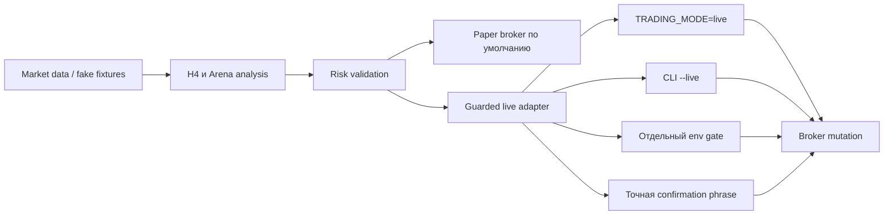

# Герман — Finam Hermes Trading Bot

**Герман — торговый ИИ-агент на Hermes. Built in the Arena. Paper by default.**

> Open-source artifact of a two-month AI-trading experiment conducted during
> the 2026 Finam Arena competition. This is **Герман (Herman)**, an AI trading
> agent built on the **Hermes** platform. The repository preserves his market
> scanning, H4/Arena analysis, risk-control, learning and guarded-execution
> layers. It is not affiliated with Finam and is not investment advice.

**Герман — это бот. Hermes — платформа, на которой он работает.** Это различие
важно для проекта: имя связывает опубликованный код с живым двухмесячным
экспериментом и интервью, а Hermes описывает его агентную среду.

## Откуда появился проект

Летом 2026 года «Финам» провёл «Финам Арену» — открытый конкурс для
алготрейдеров и разработчиков ИИ-систем. Торги шли с 1 июня по 31 июля: участники
управляли тремя конкурсными портфелями с виртуальным капиталом по 1 млн рублей,
а сделки исполнялись по реальным рыночным котировкам через Finam Trade API.

Этого бота зовут **Герман**. Имя появилось ещё во время конкурса: в
[интервью Finam.ru](https://www.finam.ru/publications/item/bitva-algoritmov-zachem-treydery-testiruyut-ii-na-finam-arene-20260627-2040/)
автор представил его как собственного ИИ-агента, собранного на платформе
Hermes. Герман появился не как отвлечённый pet project. В течение двух месяцев
он работал как торговый контур на Hermes: каждый торговый
день сканировал рынок, формулировал гипотезы, проверял риск, готовил или
исполнял допустимые действия и сохранял материал для разбора ошибок. Поэтому
репозиторий — публичный инженерный артефакт эксперимента, а не обещание готовой
прибыльной стратегии.

В интервью автор проекта описал шесть уровней системы Германа:

1. рыночный сканер — инструменты, ликвидность, цена и волатильность;
2. торговая гипотеза — вход, риск, ожидаемый сценарий и условие отмены;
3. риск-контроль — размер позиции, просадка и право полностью запретить сделку;
4. исполнительный контур — подтверждения и проверки перед заявкой;
5. обучающий слой — статистика решений, сделок и ошибок;
6. человек над системой — рамки эксперимента и защита от превращения его в казино.

По описанию в интервью, Герман чаще говорил «не торговать», чем «срочно
покупать». Поэтому его роль в проекте — не изображать «волшебную нейросеть», а
превращать работу ИИ-агента с рынком в контролируемый, проверяемый и обучающий
эксперимент.

Статья вышла 27 июня и показывает проект в середине конкурса. Код в этом
репозитории отражает весь двухмесячный путь и последующую подготовку к открытой
публикации. Реальные токены, идентификаторы счетов, история сделок, конкурсные
результаты и приватная инфраструктура намеренно не опубликованы.

Подробнее о формате и датах: [анонс конкурса Finam.ru](https://www.finam.ru/publications/item/konkurs-dlya-treyderov-3-000-000-pod-upravlenie-denezhnye-prizy-i-prodvizhenie-strategiy-pobediteley-20260518-1102/).

Экспериментальный Python-проект для исследования рынка, paper trading,
риск-контроля и защищённого исполнения через Finam API. В репозитории сохранены
H4/Arena-контуры и опциональный адаптер Hermes, но опубликованные конфигурации
обезличены и заблокированы для live-торговли.

Проект не является инвестиционной рекомендацией, не обещает доходность и не
аффилирован с Finam. Автоматическая торговля может привести к полной потере
капитала. Перед использованием изучите код, документацию API и ограничения
своего счёта.

## Что умеет Герман

- локальный детерминированный paper broker без сети;
- риск-проверки заявки: допустимый инструмент, размер заявки и позиции,
  дневной убыток и запрет short по умолчанию;
- read-only клиент Finam для счетов, сделок, заявок и market data;
- формирование H4/Arena-кандидатов, портфельный review и stop-контур;
- guarded live-исполнение с независимыми флагами, точными confirmation phrases
  и проверкой защитного stop;
- Telegram-отчёты и опциональный Hermes/operator CLI;
- локальная диагностика, маскирование credentials и audit journal.

Проект не предоставляет готовую прибыльную стратегию, облачный сервис,
гарантированную совместимость с будущими версиями Finam API или поддержку
реального счёта без самостоятельной проверки пользователя.

## Безопасная модель Германа



`TRADING_MODE` отсутствует — значит используется `paper`. Низкоуровневые
mutation-методы клиента также проверяют этот режим и отклоняют пустые или
демонстрационные account ID. Поэтому один случайно добавленный `--live` не
открывает торговлю.

## Требования и установка

- Python 3.11 или новее;
- Linux рекомендуется для Hermes/systemd-адаптера;
- токены не нужны для doctor и paper-demo.

```bash
git clone https://github.com/pzzz404/finam-hermes-trading-bot.git
cd finam-hermes-trading-bot
python -m venv .venv
. .venv/bin/activate
python -m pip install --upgrade pip
python -m pip install -e '.[dev,charts]'
```

## Быстрый безопасный запуск

```bash
TRADING_MODE=paper python -m finam_trading_bot doctor --json
TRADING_MODE=paper python -m finam_trading_bot paper-demo --json
```

Обе команды полностью офлайн. `doctor` не проверяет доступность брокера, а
только локальную конфигурацию. Сетевые read-only проверки вынесены в отдельные
скрипты и никогда не должны использоваться как доказательство готовности live.
`.env.example` служит шаблоном: основной CLI намеренно не загружает `.env`
автоматически; передавайте переменные через shell, secret store или systemd
environment file.

## Переменные окружения

| Переменная | По умолчанию | Назначение |
| --- | --- | --- |
| `TRADING_MODE` | `paper` | Глобальный режим: только `paper` или `live`. |
| `FINAM_TOKEN` | пусто | Секрет Finam API; обязателен только для API-доступа. |
| `FINAM_ACCOUNT_ID` | пусто | ID выбранного счёта; demo-placeholder блокирует mutation. |
| `FINAM_ARENA_API` | пусто | Отдельный Arena credential. |
| `FINAM_ARENA_BASE_URL` | официальный Arena URL | Переопределение endpoint. |
| `FINAM_ARENA_AUTO_TRADE_ENABLED` | `false` | Дополнительный Arena live-gate. |
| `FINAM_ARENA_EXECUTOR_MUTATIONS_ENABLED` | `false` | Разрешение mutation для executor wrapper. |
| `FINAM_H4_ALLOW_LIVE_DEMO_ORDERS` | `false` | Дополнительный H4 demo live-gate. |
| `FINAM_H4_AUTONOMOUS_DEMO_ENABLED` | `false` | Разрешение автономного H4 demo. |
| `TELEGRAM_BOT_TOKEN` | пусто | Опциональная Telegram-интеграция. |
| `FINAM_H4_TELEGRAM_CHAT_ID` | пусто | Получатель отчётов; вывод должен маскировать ID. |
| `FINAM_EXPECTED_PROXY` | пусто | Опциональная проверка конкретного proxy URL. |
| `NO_PROXY` | системное значение | При настроенном proxy Finam-hosts должны идти напрямую. |

Реальные значения храните вне checkout с правами доступа только для владельца.
Не передавайте `.env`, systemd environment files и вывод диагностики в issue.

## Политики H4 и Arena

`config/finam_h4_policy.json` и `config/finam_arena_policy.json` — безопасные
примеры, а не рекомендуемые торговые настройки. В Arena используются
`DEMO-RU`, `DEMO-US`, `DEMO-AI`; все профили paused/manual, а emergency stop
включён. Перед любым live-экспериментом пользователь обязан:

1. сделать копию конфигурации вне Git;
2. заменить demo account ID реальными значениями;
3. проверить поддерживаемые инструменты, lot size и price step;
4. независимо проверить риск-пороги и stop-поведение;
5. выполнить paper/dry-run и read-only диагностику;
6. только затем осознанно открыть каждый live-gate.

## Герман, Hermes и systemd

Герман — имя торгового агента и публичная идентичность проекта; Hermes —
платформа его агентного runtime. Основная библиотека не зависит от Hermes.
`scripts/hermes_operator.py`
предоставляет стабильный CLI-адаптер, а `ops/systemd/user/` содержит шаблоны.
Шаблоны намеренно запускаются с `TRADING_MODE=paper`, `--dry-run` или без
`--live`; копирование unit-файла не включает торговлю. По умолчанию адаптеры
ищут runtime env в `~/.config/finam-hermes-trading-bot/runtime.env`, а Hermes
credentials — в `~/.config/hermes/.env`.

Пример ручного безопасного вызова:

```bash
python scripts/hermes_operator.py policy-validate
python scripts/hermes_operator.py report-preview
python scripts/hermes_operator.py arena-status --dry-run
```

Пути state/env задаются переменными окружения. Локальные runtime-файлы должны
находиться в `data/runtime/` или пользовательском state-каталоге и исключены из
Git.

## Проверки

```bash
ruff check .
pytest --disable-socket -q
python -m build
python -m pip_audit
```

`pytest --disable-socket` запрещает тестам создавать сетевые соединения. Все
внешние клиенты должны заменяться fake/mock. В CI дополнительно выполняются
Gitleaks, dependency audit и CodeQL.

## Структура

```text
src/finam_trading_bot/  библиотека, risk, paper, H4/Arena, safety
scripts/                operator/Hermes и read-only инструменты
config/                 обезличенные заблокированные demo-политики
ops/systemd/user/       безопасные user-unit шаблоны
tests/                  офлайн-тесты
```

## Ограничения

- Finam API и Arena могут изменить wire format или правила доступа;
- не все рынки и инструменты поддерживают одинаковые типы заявок;
- research/LLM-оценка является вспомогательной и не снимает risk-gates;
- systemd-шаблоны требуют адаптации путей и расписания;
- сопровождение и обратная совместимость не гарантируются.

Текущий статус: экспериментальный публичный релиз. Используйте только после
самостоятельного аудита.

## Лицензия

Код распространяется по лицензии MIT. См. [LICENSE](LICENSE).
